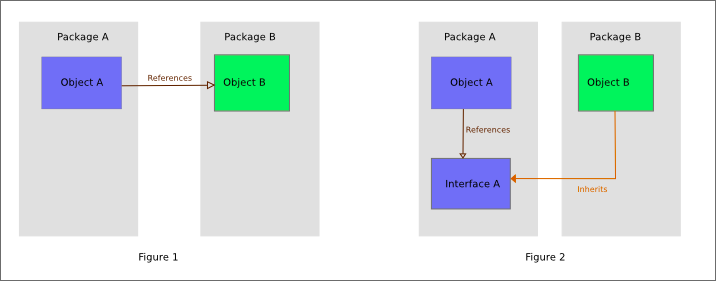

# SOLID
Является аббревиатурой из первых букв названий принципов:
- [SRP](#SRP---принцип-единственной-ответственности)
- [OCP](#OCP---принцип-открытости/закрытости)
- [LSP](#LSP---принцип-подстановки-Лисков)
- [ISP](#ISP---принцип-разделения-интерфейса)
- [DIP](#DIP---принцип-инверсии-зависимости)

## SRP - принцип единственной ответственности
Для изменения класса должна быть лишь одна причина. 
Класс не должен отвечать за много разных частей, 
иначе могут возникнуть трудности с расширением функционала.

Рассмотрим случай: у нас есть класс `Chat` и мы хотим при помощи его 
метода `OnSendMessage` ловить все отправленные игроком сообщения.

### Как НЕ надо делать
```php
class Chat{

    public function handlePlayerMessage(Player $player, string $message): void{
        if($this->hasBadWords($message)){ // валидация
            throw new Exception(...);
        }
        
        $playerName = $player->getName();
        $this->getLogger()->info("Player $playerName just sent $message"); // логирование
        
        $playerLevel = $player->getLevel();
        $formattedMessage = "($playerLevel) $playerName > $message"; // форматирование чата
        
        foreach($player->getPlayersNearby() as $anotherPlayer){ // рассылка всем игрокам неподалеку
            $anotherPlayer->sendMessage($formattedMessage);
        }
    }
    
    protected function hasBadWords(string $message): bool{...}
    protected function getLogger(): Logger{...}

}

class Logger{
    
    public function info(string $message): void{...}
    
}
```

Как можно заметить, здесь в 1 методе перемешано все что можно: и валидация, и форматирование, и рассылка всем игрокам поблизости. 

Разумеется, поддерживать такое сложно. Что, если мы захотим сюда что-то добавить? Каков риск получить новые баги буквально из ниоткуда? Такой риск довольно высок.

Также такая груда кода не позволяет нормально писать тесты. Как отдельно протестировать форматирование чата?

Также это мешает переиспользовать код. Что если я хочу использовать валидацию сообщения еще для других целей? 

Есть даже наихудший вариант нарушения этого принципа - [God class](https://ru.wikipedia.org/wiki/%D0%91%D0%BE%D0%B6%D0%B5%D1%81%D1%82%D0%B2%D0%B5%D0%BD%D0%BD%D1%8B%D0%B9_%D0%BE%D0%B1%D1%8A%D0%B5%D0%BA%D1%82). 

### Как стоит делать
```php
class Chat {

    public function handlePlayerMessage(Player $player, string $message): void{
        $validator = $this->getValidator();
        $validator->checkMessage($message);
        
        $logger = $this->getLogger();
        $logger->info("Player $playerName just sent $message");
        
        $formatter = $this->getFormatter();
        $formattedMessage = $formatter->format($player, $message);
        
        $this->sendMessageToNearbyPlayers($player, $message);
    }
    
    protected function sendMessageToNearbyPlayers(Player $player, string $message): void{
        foreach($player->getPlayersNearby() as $anotherPlayer){ // рассылка всем игрокам неподалеку
            $anotherPlayer->sendMessage($formattedMessage);
        }
    }
    
    protected function getValidator(): ChatValidator{...}
    protected function getLogger(): Logger{...}
    protected function getFormatter(): ChatFormatter{...}

}

class ChatValidator {
    /** @throws Exception */
    checkMessage(string $message): void{...}
}

class Logger{
    public function info(string $message): void{...}   
}

class ChatFormatter {
    public function format(Player $player, string $message): string{
        $playerLevel = $player->getLevel();
        $formattedMessage = "($playerLevel) $playerName > $message";
        
        return $formattedMessage;
    }
}
```
Разумеется это решение не претендует быть на звание лучшего, однако основную суть он передает.

Нетрудно заметить, что часть функционала мы вынесли в отдельные классы/методы.

## OCP - принцип открытости/закрытости
Классы должны быть открыты для расширения, но закрыты для изменения. 

Поведение сущности может быть расширенно путем создания новых типов сущностей. 
Например, чтобы добавить новое поле или функцию it performs 
В результате расширения поведения не должен меняться код сущности. 

### Как НЕ надо делать
```php
class User {
    public $role;
}

function sumSalary(array $users){
    $total = 0;
    foreach($users as $user){
        if($user->role === 'admin'){
            $total += 1000;
        }elseif($user->role === 'moderator'){
            $total += 500;
        }else{
            $total += 100;
        }
    }
    
    return $total;
} 
```

При добавлении новой роли придется редактировать эту функцию. 
Также, если мы захотим поменять расчет зарплаты для определенной роли, мы не сразу поймем, где это менять. 

### Как стоит делать
Применяем всю мощь ООП.
```php
interface User{
    public function getSalary(): int;
}

class AdminUser implements User{
    public function getSalary(): int{
        return 1000;
    }
}

class ModeratorUser implements User{
    public function getSalary(): int{
        return 500;
    }
}

class SimpleUser implements User{
    public function getSalary(): int{
        return 100;
    }
}

function sumSalary(array $users){
    $total = 0;
    /** @var User $user */
    foreach($users as $user){
        $total += $user->getSalary();
    }
    
    return $total;
}
```

Теперь при добавлении новой роли пользователя не придется менять функцию `sumSalary`, будет достаточно всего лишь добавить класс.

## LSP - принцип подстановки Лисков
Функции, использующие базовый тип, должны иметь возможность использовать подтипы базового типа, не зная об этом. 

```php
class User{
    public function getSalary(): int{
        return 100;
    }
}

class AdminUser extends User{
    public function getSalary(): int{
        return 200;
    }
}

function getAnnualSalary(User $user): int{
    return $user->getSalary() * 12;
}
```

Суть в том, что передав `AdminUser` в `getAnnualSalary()` ничего не должно сломаться.

`AdminUser::getSalary()` не должен требовать большего чем `User::getSalary()`. 
Используя User::getSalary() мы должны быть уверены в том, что в этом методе дочерних классов не появятся дополнительные 
требования и не вылезут вещи, связанные с конкретной реализацией.  

## ISP - принцип разделения интерфейса
Вместо одного большого интерфейса лучше много маленьких под нужды конкретного клиента.

### Как НЕ надо делать
```php
interface UserInterface{
    public function getMoney(): int;
    public function getName(): string;
}

class User implements UserInterface{
    protected $money;
    protected $name;
    
    public function getMoney(): int{
        return $this->money;
    }
    
    public function getName(): string{
        return $this->name;
    }
}
```

### Как стоит делать
```php
interface EntityWithMoney{
    public function getMoney(): int;
}

interface EntityWithName{
    public function getName(): string;
}

class User implements EntityWithMoney, EntityWithName{
    protected $money;
    protected $name;
    
    public function getMoney(): int{
        return $this->money;
    }
    
    public function getName(): string{
        return $this->name;
    }
}
```

Для чего это может пригодиться? Например, функция для подсчета суммы всех денег пользователей 
и **прочих сущностей** (например, компании, у них может быть свой счет).

```php
/** @var EntityWithMoney[] $entities */
function sumAllMoney(array $entities): int{
    $sum = 0;
    foreach($entities as $entity){
        $sum += $entity->getMoney();
    }
    
    return $sum;
}
```

## DIP - принцип инверсии зависимости
Модули верхних уровней не должны зависеть от модулей нижних уровней. Оба типа модулей должны зависеть от абстракций.

Абстракции не должны зависеть от деталей. Детали должны зависеть от абстракций.

Если по простому, то не должно быть прямого обращения к классам. Это должно быть сделано через интерфейсы.



Для чего это нужно? Например для mocking'а классов, применения паттерна [proxy](https://refactoring.guru/ru/design-patterns/proxy).

```php
interface UserInterface{
    public function getName(): int;
}

class User implements UserInterface{
    protected $name;

    public function getName(): string{
        return $this->name;
    }
}
```